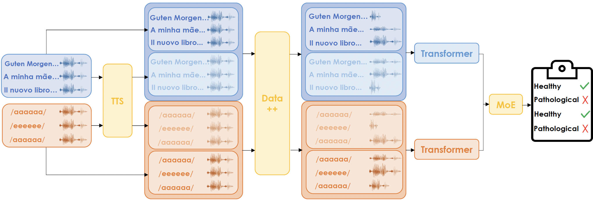

# Voice Disorder Analysis with Transformers

 

This repo contains the code for the paper "*Voice Disorder Analysis: A Transformer-based Approach*", accepted at Interspeech 2024.

  

This paper proposes a novel solution to detect and classify pathologies from voice. We adopt transformers that work directly on raw voice signals and address data shortages through synthetic data generation and data augmentation. Further, we consider many recording types simultaneously, such as sentence reading and sustained vowel emission, by employing a Mixture of Expert ensembles to align the predictions on different data types.

In this repository, you will find the code to replicate our experiments.  
We do not include the datasets used in the paper as they are publicly available: [SVD](https://stimmdb.coli.uni-saarland.de/) and [AVFAD](https://www.intechopen.com/chapters/55960).  
Our internal **IPV** dataset is not publicly available yet, but we are working on releasing it soon.

## Experimental Settings 

### Datasets 
We consider two publicly available datasets, the German **SVD** and the Portuguese **AVFAD**. We also assess the performance of our approach on an internal Italian **IPV** dataset. 
We refine public datasets to focus on similar recordings, i.e., only readings of given sentences and emissions of sustained vowels, both in a typical setting (i.e., with normal pitch).

*SVD.* The Saarbruecken Voice Database includes voice recordings and electroglottography (EGG) data, with 13 files per recording session, incorporating vowels /a, i, u/ with pitch variations (normal, high, low, rising-falling) and a sentence reading task. For consistency, we only considered the sentence reading and the normal pitch vowels.
The dataset does not aggregate pathologies into macro-classes. Thus, for the disorder classification task, we considered the 6-most frequent classes.

*AVFAD.* The Advanced Voice Function Assessment Databases collect audio recordings capturing participants performing various vocal tasks, including sustaining vowels /a, e, o/, reading six sentences, reading a phonetically balanced text, and engaging in spontaneous speech, everything repeated three times. For consistency, we concatenate the six sentences together, having three repetitions for each obtained audio. We also concatenate the sustained vowels by repetition, thus obtaining 3 audios, one for each vowel.

*IPV.* The Italian Pathological Voice (IPV) is a novel dataset we use to test the proposed method further. The study recruited participants from several private phoniatric and speech-therapy practices and hospitals in Italy. Participants included both euphonic individuals seeking otolaryngological evaluations and participants with various degrees of dysphonia. Dysphonic participants exhibited organic and functional voice disorders of varying severity. %Exclusion criteria comprised individuals unable to sustain phonation for at least 3 seconds or those using substitute voice methods post-laryngectomy. Each participant underwent videolaryngostroboscopic examinations, perceptual voice evaluations, and acoustic voice analysis conducted by experienced physicians. Data collection involved two tasks: sustained production of the vowel /a/, and a reading of five phonetically balanced sentences derived from the Italian adaptation of the CAPE-V.
Voice samples were recorded under standardized conditions, keeping a consistent mouth-to-microphone distance of 30 cm and ensuring a quiet environment with a signal-to-noise ratio exceeding 30 dB. 
The study adhered to the principles of the Declaration of Helsinki, with all participants providing informed consent. Data analysis was conducted retrospectively and anonymously on the recorded voice samples.

### Models
We reproduced the 1D and 2D CNN architectures presented in [[1]](https://www.sciencedirect.com/science/article/pii/S2666990022000258) and [[2]](https://www.nature.com/articles/s41598-023-34461-9), respectively. For a fair comparison, we re-implemented and trained these models
For the CNN-2D, we experimented with various MFCCs. We show the results for MFCC=40, which yielded the best outcomes overall. 
We also report the performance of vanilla transformers. 
The suite of transformers evaluated in this work includes wav2vec 2.0, WavLM, and HuBERT in their base sizes (ca. 90M parameters). 
For wav2vec 2.0 and HuBERT, we further employ the version pre-trained on Audioset introduced in [ARCH](https://github.com/MorenoLaQuatra/ARCH).

### Training Procedure
The pre-trained checkpoints of these transformer-based models are obtained from the [Hugging Face hub](https://huggingface.co/models). We trained the models for $300$ steps for pathologies detection and $2500$ for pathologies classification, with a batch size of $8$, using the AdamW optimizer with a learning rate of $10^{-4}$ and $0.01$ warmup ratio.
We performed a $10$-fold cross-validation (CV) for all the considered datasets. 
A robust data augmentation pipeline was employed to randomly replicate various noisy environments and introduce alterations in pitch (higher and lower) and time (stretched and compressed), either individually or in combination. We applied a more frequent and intense data augmentation for sentences and a slightly weaker approach for vowels, as overly aggressive augmentation for this audio type reduces the quality of the recording.
Experiments were run on a machine equipped with Intel Core $^{TM}$ i9-10980XE CPU, $1$ $\times$ Nvidia RTX A6000 GPU, $64$ GB of RAM running Ubuntu $22.04$ LTS. 

## License
This code is released under the Apache 2.0 license. See the [LICENSE](LICENSE) file for more details.

## Contact
For any questions, please contact [Alkis Koudounas](mailto:alkis.koudounas@polito.it).
